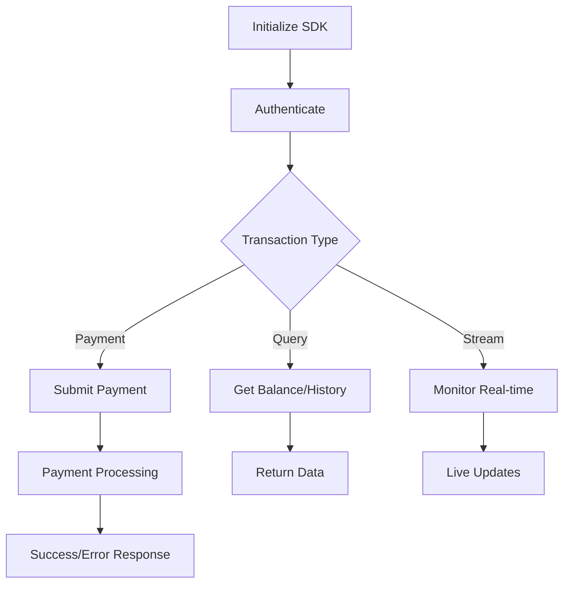

<div align="center">
  
</div>

# SofizPay SDK JS

**The official JavaScript SDK for secure digital payments and transactions.**

[](https://www.npmjs.com/package/sofizpay-sdk)
[](https://opensource.org/licenses/MIT)

## Quick Start

### Installation

```bash
npm install sofizpay-sdk-js
```

### Basic Usage

```javascript
import SofizPaySDK from 'sofizpay-sdk-js';

const sdk = new SofizPaySDK();

// Send payment
const result = await sdk.submit({
  secretkey: 'YOUR_SECRET_KEY',
  destinationPublicKey: 'RECIPIENT_PUBLIC_KEY',
  amount: 100,
  memo: 'Payment description'
});

console.log(result.success ? 'Payment sent!' : result.error);
```

## Features

- ✅ **Send Secure Payments** - Instant digital transactions
- ✅ **Get Account Balance** - Real-time balance checking
- ✅ **Transaction History** - Complete transaction records
- ✅ **Search & Filter** - Find transactions by memo or hash
- ✅ **Real-time Streaming** - Live transaction notifications with flexible options
- ✅ **Multi-platform** - Works everywhere (Browser, Node.js, React, Vue)
- ✅ **Flexible Monitoring** - Stream from now or with full history, customizable intervals

## Usage Examples

### Browser (CDN)

```html
<script src="https://unpkg.com/stellar-sdk@12.3.0/dist/stellar-sdk.min.js"></script>
<script src="https://cdn.jsdelivr.net/npm/node-forge@1.3.1/dist/forge.min.js"></script>
<script src="https://unpkg.com/axios@1.10.0/dist/axios.min.js"></script>
<script src="https://unpkg.com/sofizpay-sdk-js@latest/dist/sofizpay-sdk.umd.js"></script>

<script>
const sdk = new SofizPaySDK();

async function sendPayment() {
  const result = await sdk.submit({
    secretkey: 'YOUR_SECRET_KEY',
    destinationPublicKey: 'DESTINATION_KEY',
    amount: 50,
    memo: 'Web payment'
  });
  
  alert(result.success ? 'Success!' : result.error);
}
</script>
```

### React

```jsx
import { useState, useEffect } from 'react';
import SofizPaySDK from 'sofizpay-sdk-js';

function WalletComponent() {
  const [sdk] = useState(() => new SofizPaySDK());
  const [balance, setBalance] = useState(0);

  useEffect(() => {
    const loadBalance = async () => {
      const result = await sdk.getBalance('YOUR_PUBLIC_KEY');
      if (result.success) setBalance(result.balance);
    };
    loadBalance();
  }, []);

  const sendPayment = async () => {
    const result = await sdk.submit({
      secretkey: 'YOUR_SECRET_KEY',
      destinationPublicKey: 'RECIPIENT_KEY',
      amount: 25,
      memo: 'React payment'
    });
    
    if (result.success) {
      alert('Payment sent successfully!');
      // Reload balance
    }
  };

  return (
    <div>
      <h2>Balance: {balance}</h2>
      <button onClick={sendPayment}>Send Payment</button>
    </div>
  );
}
```

### Node.js

```javascript
import SofizPaySDK from 'sofizpay-sdk-js';

const sdk = new SofizPaySDK();

async function main() {
  // Check balance
  const balance = await sdk.getBalance('YOUR_PUBLIC_KEY');
  console.log(`Current balance: ${balance.balance}`);

  // Send payment
  const payment = await sdk.submit({
    secretkey: 'YOUR_SECRET_KEY',
    destinationPublicKey: 'RECIPIENT_KEY',
    amount: 100,
    memo: 'Server payment'
  });

  console.log(payment.success ? 'Payment sent!' : payment.error);
}

main();
```

## API Reference

### Core Methods

| Method | Description | Example |
|--------|-------------|---------|
| `submit(data)` | Send secure payment | `sdk.submit({secretkey, destinationPublicKey, amount, memo})` |
| `getBalance(publicKey)` | Get account balance | `sdk.getBalance('GXXX...')` |
| `getTransactions(publicKey, limit)` | Get transaction history | `sdk.getTransactions('GXXX...', 50)` |
| `getTransactionByHash(hash)` | Find transaction by hash | `sdk.getTransactionByHash('abc123...')` |
| `searchTransactionsByMemo(publicKey, memo, limit)` | Search by memo | `sdk.searchTransactionsByMemo('GXXX...', 'payment', 50)` |
| `getPublicKey(secretKey)` | Get public key from secret key | `sdk.getPublicKey('SXXX...')` |
| `startTransactionStream(publicKey, callback, fromNow, checkInterval)` | Start real-time monitoring | `sdk.startTransactionStream('GXXX...', callback, true, 30)` |
| `stopTransactionStream(publicKey)` | Stop real-time monitoring | `sdk.stopTransactionStream('GXXX...')` |
| `getStreamStatus(publicKey)` | Check stream status | `sdk.getStreamStatus('GXXX...')` |
| `makeCIBTransaction(transactionData)` | Create bank transaction | `sdk.makeCIBTransaction({account, amount, full_name, phone, email})` |
| `verifySignature(verificationData)` | Verify digital signature | `sdk.verifySignature({message, signature_url_safe})` |

### Bank Transaction Parameters

```javascript
const transactionData = {
  account: 'string',          // User account identifier
  amount: 'number',           // Transaction amount (must be > 0)
  full_name: 'string',        // Customer full name
  phone: 'string',            // Customer phone number
  email: 'string',            // Customer email address
  
  // Optional parameters
  memo: 'string',             // Transaction description/memo
  return_url: 'string',       // URL to redirect after payment
  redirect: 'boolean'         // Whether to redirect automatically
};
```

### Signature Verification Parameters

```javascript
const verificationData = {
  message: 'string',              // Original message to verify
  signature_url_safe: 'string'   // Base64URL-encoded signature
};
```

### Advanced Features

```javascript
// Get public key from secret key
const result = await sdk.getPublicKey('YOUR_SECRET_KEY');
if (result.success) {
  console.log('Public key:', result.publicKey);
}

// Real-time transaction monitoring - New transactions only
await sdk.startTransactionStream('YOUR_PUBLIC_KEY', (newTx) => {
  console.log('New transaction received:', newTx);
}, true, 30); // fromNow=true, checkInterval=30 seconds

// Real-time monitoring with full history first
await sdk.startTransactionStream('YOUR_PUBLIC_KEY', (transaction) => {
  if (transaction.isHistorical) {
    console.log('Historical transaction:', transaction);
  } else {
    console.log('New transaction received:', transaction);
  }
}, false, 15); // fromNow=false, checkInterval=15 seconds

// Stop monitoring
await sdk.stopTransactionStream('YOUR_PUBLIC_KEY');

// Check stream status
const status = await sdk.getStreamStatus('YOUR_PUBLIC_KEY');
console.log('Stream active:', status.isActive);

// Search transactions by memo with custom limit
const searchResults = await sdk.searchTransactionsByMemo('YOUR_PUBLIC_KEY', 'payment', 100);
if (searchResults.success) {
  console.log('Found transactions:', searchResults.transactions);
}

// Get specific transaction by hash
const transaction = await sdk.getTransactionByHash('TRANSACTION_HASH_HERE');
if (transaction.success) {
  console.log('Transaction details:', transaction.transaction);
}
```

### Utility Functions

```javascript
// Convert secret key to public key
const keyResult = await sdk.getPublicKey('SXXXXXXXXXXXXXXXXXXXXXXXXXXXXXXXXXXXXXXXXXXXXXXXXX');
if (keyResult.success) {
  console.log('Derived public key:', keyResult.publicKey);
  // Use this public key for balance checking, transaction queries, etc.
  const balance = await sdk.getBalance(keyResult.publicKey);
}

// Get complete transaction history with custom limit
const allTransactions = await sdk.getTransactions('YOUR_PUBLIC_KEY', 200);
if (allTransactions.success) {
  console.log(`Found ${allTransactions.transactions.length} transactions`);
  allTransactions.transactions.forEach(tx => {
    console.log(`${tx.type}: ${tx.amount} - ${tx.memo} (${tx.timestamp})`);
  });
}

// Search for specific payments by memo
const orderPayments = await sdk.searchTransactionsByMemo('YOUR_PUBLIC_KEY', 'Order #12345', 10);
if (orderPayments.success && orderPayments.transactions.length > 0) {
  console.log('Found order payments:', orderPayments.transactions);
} else {
  console.log('No payments found for this order');
}
```

### Bank Integration

```javascript
// Create bank transaction
const bankResult = await sdk.makeCIBTransaction({
  account: 'YOUR_PUBLIC_KEY',
  amount: 150,
  full_name: 'YOUR_NAME',
  phone: '+213*********',
  email: 'YOUR_EMAIL',
  memo: 'Payment',
  return_url: 'https://yoursite.com/payment-success',
  redirect: true
});

if (bankResult.success) {
  console.log('Bank transaction created:', bankResult.url);
  // Redirect user to payment page or handle response
} else {
  console.error('Bank transaction failed:', bankResult.error);
}
```

### Real-time Streaming Options

The `startTransactionStream` method accepts these parameters:

| Parameter | Type | Default | Description |
|-----------|------|---------|-------------|
| `publicKey` | `string` | - | **Required**. Account public key to monitor |
| `callback` | `function` | - | **Required**. Function called for each transaction |
| `fromNow` | `boolean` | `true` | `true`: Only new transactions, `false`: Load history then monitor |
| `checkInterval` | `number` | `30` | Reconnection interval in seconds (5-300) |

```javascript
// Example: Load last 200 transactions then monitor new ones
await sdk.startTransactionStream(
  'GXXX...', 
  (tx) => console.log(tx), 
  false,  // Load historical transactions first
  10      // Check every 10 seconds
);

// Example: Monitor only new transactions with custom interval
await sdk.startTransactionStream(
  'GXXX...', 
  (tx) => console.log('Live transaction:', tx), 
  true,   // From now only
  60      // Check every minute
);
```

### Digital Signature Verification

```javascript
// Verify digital signature (for webhook validation)
const isValid = sdk.verifySignature({
  message: 'wc_order_LI3SLQ7xA7IY9cib84907success23400',
  signature_url_safe: 'jHrONYl2NuBhjAYTgRq3xwRuW2ZYZIQlx1VWgiObu5FrSnY78pQ...'
});

if (isValid) {
  console.log('Signature is valid - proceed with order');
} else {
  console.log('Invalid signature - reject request');
}

// Common use case: Webhook validation
app.post('/webhook', (req, res) => {
  const { message, signature } = req.body;
  
  if (sdk.verifySignature({ message, signature_url_safe: signature })) {
    // Process the webhook
    res.status(200).send('OK');
  } else {
    res.status(400).send('Invalid signature');
  }
});
```

## Response Format

All methods return a consistent response format:

```javascript
// Success
{
  success: true,
  // ... method-specific data
  timestamp: "2025-07-28T10:30:00.000Z"
}

// Error
{
  success: false,
  error: "Error description",
  timestamp: "2025-07-28T10:30:00.000Z"
}
```

## Configuration

The SDK is pre-configured for secure digital transactions:

- **Network**: Mainnet
- **Security**: Enterprise-grade encryption
- **Performance**: Optimized for high-throughput operations

## Security Best Practices

⚠️ **Important Security Notes:**

- Never expose secret keys in client-side code
- Use environment variables for sensitive data
- Always test on test environment first
- Validate all inputs before sending transactions

```javascript
// ✅ Good - Environment variable
const secretKey = process.env.SECRET_KEY;

// ❌ Bad - Hardcoded in code
const secretKey = 'SXXXXXXXXXXXXX...';
```

## Transaction Flow



## Examples Repository

Find complete examples at: [github.com/kenandarabeh/sofizpay-sdk/examples](https://github.com/kenandarabeh/sofizpay-sdk/tree/main/examples)

## Support

- 📚 **Documentation**: [Full API Docs](https://github.com/kenandarabeh/sofizpay-sdk#readme)
- 🐛 **Issues**: [Report Bug](https://github.com/kenandarabeh/sofizpay-sdk/issues)
- 💬 **Discussions**: [Community Help](https://github.com/kenandarabeh/sofizpay-sdk/discussions)
- 🌐 **Website**: [SofizPay.com](https://sofizpay.com)

## Use Cases

### E-commerce Integration
Perfect for online stores needing secure payment processing:
```javascript
// Process customer payment
const orderPayment = await sdk.submit({
  secretkey: process.env.STORE_SECRET_KEY,
  destinationPublicKey: customerKey,
  amount: orderTotal,
  memo: `Order #${orderId}`
});
```

### Financial Applications
Built for fintech apps requiring real-time transaction monitoring:
```javascript
// Monitor account activity
await sdk.startTransactionStream(userKey, (transaction) => {
  updateUI(transaction);
  notifyUser(transaction);
});
```

### Enterprise Solutions
Scalable for high-volume business operations:
```javascript
// Batch processing
const results = await Promise.all(
  payments.map(payment => sdk.submit(payment))
);
```

## Performance

- **Speed**: Sub-second transaction processing
- **Reliability**: 99.9% uptime guarantee
- **Scalability**: Handles thousands of transactions per second
- **Global**: Worldwide transaction support

## License

MIT © [SofizPay Team](https://github.com/kenandarabeh)

---

**Built with ❤️ for Sofizpay | Version `1.1.8`**
